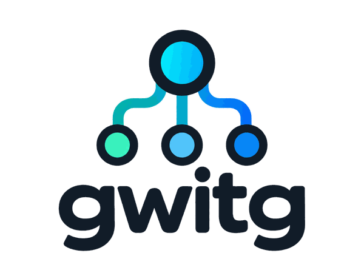

<p align="center">
  
</p>

<p align="center">
  <strong>Delegate independent work to subagents without turning the parent agent into a progress monitor.</strong>
</p>

<p align="center">
  <a href="https://github.com/Twil3akine/gwitg/releases"></a>
  <a href="./SKILL.md"></a>
</p>

# gwitg

`gwitg`は、Codexが独立した作業をサブエージェントへ委任し、必要に応じて並列実行するためのAgent Skillです。

中心となる考え方は、**作業を任せた後に親エージェントが進捗監視を続けないこと**です。親エージェントは結果を待つ間、別の独立した作業を進めます。

```text
parent agent
├─ investigate-api
├─ tests
└─ review

        ↓ completed results

parent integrates and validates
```

状態確認そのものは禁止しませんが、短い間隔でのポーリングや途中ログを使った進捗監視は行いません。詳しい運用ルールは[SKILL.md](SKILL.md)に定義しています。

## Quick Start

### ユーザー単位で使う

```sh
git clone https://github.com/Twil3akine/gwitg ~/.codex/skills/gwitg
```

### 特定のリポジトリだけで使う

対象リポジトリで実行します。

```sh
mkdir -p .codex/skills
git clone https://github.com/Twil3akine/gwitg .codex/skills/gwitg
```

Codexへ明示的に指定する場合は、次のように依頼します。

```text
gwitgを使ってこの作業を進めて
```

スキルの自動選択に任せることもできます。

## どう動くか

親エージェントは、頻繁な同期が不要で、目的と完了条件を明確にできる作業をサブエージェントへ委任します。

典型的には次のような作業が対象です。

- repository investigation
- bug investigation
- well-defined implementation
- test writing
- independent code review
- documentation investigation
- codebase search
- self-contained experiments
- validation against explicit acceptance criteria

独立した作業が複数あれば、依存関係が許す範囲で並列に実行します。

サブエージェントの既定設定は次のとおりです。

```text
model: 6-luna
reasoning effort: high
Fast mode: environment default
```

この設定を利用できない場合、別のworker設定へ無断で切り替えません。

### 実行中のルール

作業を任せた後も、必要であれば`running`、`completed`、`failed`などの状態を確認できます。

ただし、次のような監視は行いません。

- 短い間隔で状態確認を繰り返す
- sleepとstatus確認を交互に行う
- 途中ログやpartial outputを確認する
- 遅いという理由だけで再起動・差し替え・モデル変更を行う

完了通知を待つ操作は許可されます。

### 実行中に伝えられること

親エージェントから実行中のsubagentへ追加で伝えられるのは、次の3種類です。

- 誤った前提の訂正
- 新たに判明した制約
- 作業の中止

目的・成果物・作業方針を変える通常の追加指示には使いません。

訂正や制約により元の依頼を続けられなくなった場合、subagentは理由を報告して停止します。

## Delegation Judge

委任すべきか判断が難しい場合だけ、外部のdecision modelを判断役として利用できます。

利用できる値は次の3つです。

| 値 | 判断役 |
| --- | --- |
| `clef` | 利用環境のClef判断ツール |
| `jev` | 利用環境のJev判断ツール |
| `none` | 親エージェント自身 |

判断役の優先順位は次のとおりです。

```text
1. ユーザーがその作業で明示した指定
2. <project-root>/.gwitg/decision-model
3. ~/.config/gwitg/decision-model
4. none
```

プロジェクト設定が存在する場合は、ユーザー共通設定より優先されます。

### 共通設定

例えば、通常はClefを使う場合は次のように設定します。

```sh
mkdir -p "$HOME/.config/gwitg"
printf '%s\n' clef > "$HOME/.config/gwitg/decision-model"
```

### プロジェクトごとの上書き

特定のリポジトリだけ別の判断役を使う場合は、プロジェクトルートに設定します。

```sh
mkdir -p .gwitg
printf '%s\n' jev > .gwitg/decision-model
```

外部の判断役を使わない場合は`none`を指定します。

```sh
printf '%s\n' none > .gwitg/decision-model
```

設定ファイルは作業開始時に一度だけ読み、その作業中は同じ判断役を利用します。子エージェントにも選択結果を渡すため、同じ作業の中で設定ファイルを繰り返し読みません。

設定値が不正、読み取り不能、または選択した外部判断ツールを利用できない場合は、その事実を伝えて親エージェントが判断します。ClefからJev、JevからClefへ無断で切り替えることはありません。

この設定は外部モデルへの接続自体を用意するものではありません。ClefやJevを実際に呼び出せるツールや接続は、利用環境側に必要です。

設定解決には次のスクリプトを使います。

```sh
python3 /path/to/gwitg/scripts/decision_model.py
```

スキルのディレクトリへ移動せず、作業対象のディレクトリから絶対パスで実行します。

## Recursive Delegation

subagentも、割り当てられた作業の中に独立したsubtaskがある場合は、さらにsubagentへ委任できます。

```text
parent
├─ investigate-api
│  ├─ inspect-cache
│  └─ inspect-tests
└─ implementation
```

再帰的に委任する場合も、同じno-pollingルールと介入制限を適用します。

子を持つsubagentは、子の完了結果を統合してから親へ完了報告します。

## `/subagent`によるユーザー操作

ユーザーは`/subagent`から実行中のsubagentを直接確認・操作できます。

gwitgで許可する操作は次の4種類です。

1. 現在の状態を確認する
2. スレッドを開く
3. `/fast`を有効・無効にする
4. モデルまたは推理レベルを変更する

親エージェントは、スレッドを開く操作や`/fast`・model・reasoning effortの変更を代理しません。

実行中workerの差し替え、目的変更、作業方針変更はこれらの例外に含まれません。

## Investigation Reports

時系列や情報の鮮度が重要な調査では、必要に応じて次を区別して報告します。

- 何を確認したか
- いつ確認したか
- 証拠がどの時点の情報を示しているか
- 現在状態を直接確認した事実か、過去の文書・ログか
- 未確認事項と制約

今日読んだ文書でも、その内容が今日の状態を示しているとは限りません。情報の時点が分からない場合は推測せず、不明とします。

単純なコード調査では、必要な項目だけを報告し、長い固定テンプレートは要求しません。

## Repository Layout

```text
gwitg/
├── assets/
│   └── gwitg_logo.png
├── README.md
├── SKILL.md
├── scripts/
│   └── decision_model.py
└── tests/
    └── test_decision_model.py
```

- [SKILL.md](SKILL.md): エージェントが従う運用ルール
- [scripts/decision_model.py](scripts/decision_model.py): decision model設定の解決
- [tests/test_decision_model.py](tests/test_decision_model.py): 設定解決のテスト

## Test

```sh
python3 -m unittest discover -s tests -v
```

## Links

- [Releases](https://github.com/Twil3akine/gwitg/releases)
- [Issues](https://github.com/Twil3akine/gwitg/issues)
- [OpenAI: Skills](https://developers.openai.com/api/docs/guides/tools-skills)
- [OpenAI: Build skills](https://developers.openai.com/plugins/build/skills)
- [OpenAI: Multi-agent](https://developers.openai.com/api/docs/guides/responses-multi-agent)
- [Agent Skills specification](https://agentskills.io/)
